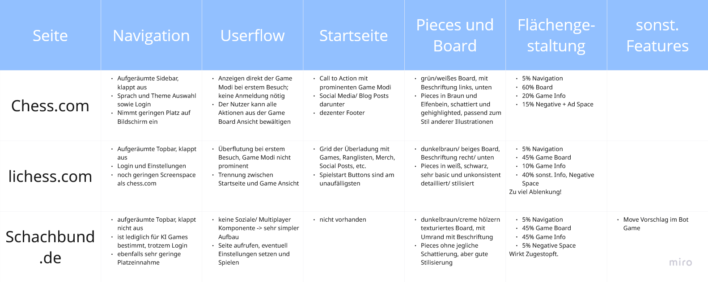
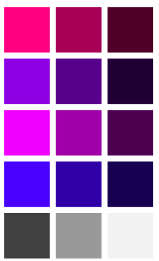
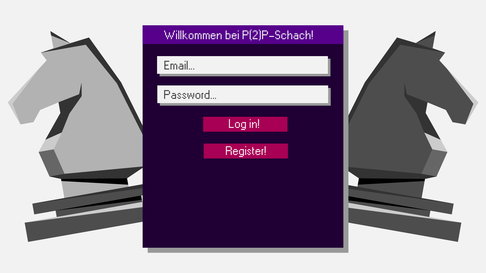
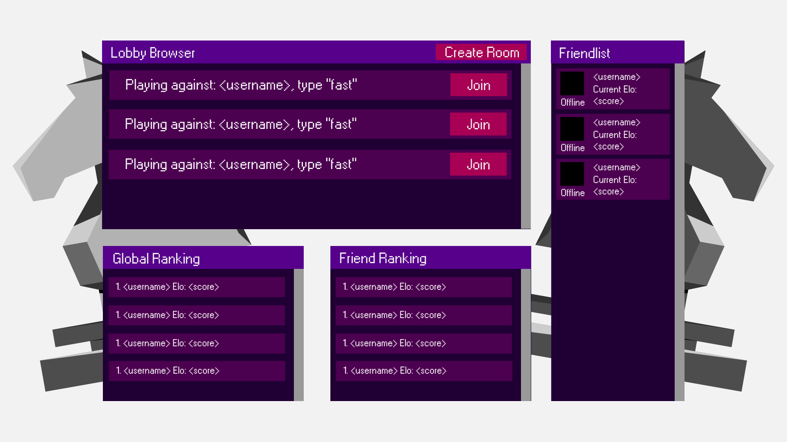
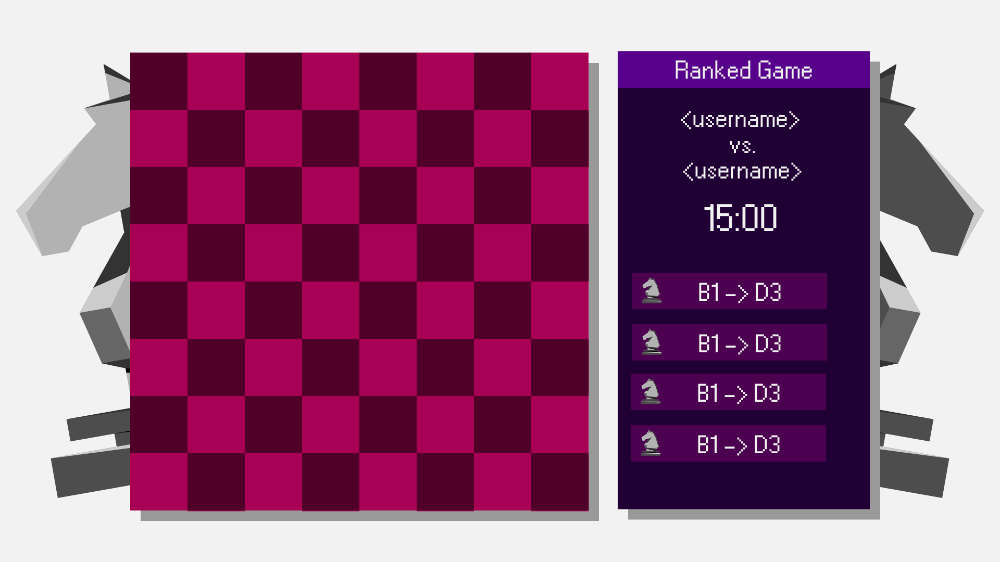

# Design Dokument

## Inhalt

1. Vorgehensplan
2. Ist-Analyse
3. Gestaltungskatalog

## 1. Vorgehensplan

### Ist-Analyse
 
> Für das Frontend, welches für Nutzer einen großen Teil der Benutzungserfahrung aus macht, ist es wichtig ein Gestaltungskonzept zu erarbeiten, dass Nutzern relevante Informationen intuitiv und interaktiv vermittelt. Aus der Vielzahl, der im Backend gesammelten Informationen muss eine Selektion getroffen, und oft einer Tranformation unterzogen werden, damit Nutzer ohne Lernkurve oder Hilfsmittel mit dem Produkt interagieren können. Dazu kann eine Analyse bereits bestehender Lösungen behilflich sein. 

Für die Ist-Analyse werden bestehende Lösungen oder Vorgängerversionen des zu entwickelnden Produktes nach Nutzererfahrung, Gestaltung, Navigation und User Flow bewertet. Wichtig ist es dabei ein breites Spektrum (falls vorhanden) abzudecken. Begonnen wird oft mit einer Online Recherche, woraufhin das Produkt getestet und Gedanken frei notiert werden. Aus diesen Notizen werden Kategorien gebildet und eine Tabelle (s. 2.) zu Zwecken der Vergleichbarkeit aufgestellt. 

---------
### Gestaltungskatalog

> Weiterhin ist auch eine einheitliche optische Gestaltung von großer Bedeutung. Nicht nur, dass Informationen einfach erkennbar werden und Interaktionsmuster wiedererkannt werden, sondern auch, weil eine gute Gestaltung die wahrgenommene Qualität steigert. Es ist also wichtig vorher Konventionen für Farben, Fonts, Effekte, Raumgestaltung festzulegen.

Nach Bewertung der Informationen der Analyse kann bereits eine primitiver User Journey festgelegt werden. Dazu gesellen sich häufig die Daten, welche an dem Punkt der Journey angezeigt werden sollen, mit ihrem ungefähren Screenspace-Anteil und ein Farb- und Formkonzept, welche textuell festgehalten werden. Als einen Guide für die Umsetzung des stylings werden zu jeder Ansicht Vektorgrafiken mittels Adobe Illustrator angefertigt. Begonnen wurde in diesem Projekt mit der Gestaltung der Schachfiguren, da ihnen offensichtlich die größte Bedeutung zu kommt.

## 2. Ist-Analyse

## 3. Gestaltungskatalog

### Textuelles Konzept

- Login:
    - einfache Login Seite
    - Wrapper mit Email und PW Feld, Login Button, Registrieren Button
    - Registrieren Button füllt Wrapper mit Registrierugsfeldern (Nutzername, PW)
    - ca. 40% für Wrapper

- Startseite:
    - Bestenlisten, Lobby Browser, Freundesliste
    - ca. 35% Lobby Browser, prominenter Beitrittsbutton
    - Bestenlisten etwa 30% (global, Freunde); zeigt Name, Score
    - Chatoverlay als Bubble am rechten unteren Rand, ausklappbar

- Game Seite:
    - ca. 60% für Board, mit 2 Schattierungen der selben Farbe
    - 20-25% für Game Info; mit Timer, Zugabfolge, geschlagene Pieces
    - Pieces in grau und weiß, stillisiert

- Gesamt:
    - Festlegen einer Farbpalette mit 1 Primärfarbe, 2 Sekundärfarben, 1 Auszeichnung und 1 Grauton mit jeweils 3 Abstufungen
    - einheitlicher Stil -> am besten bei Pieces anfangen

### Grafisches Konzept

>Für die Gestaltung der Figuren wurde ein polygonaler Stil ausgewählt, bei dem frühe 3D-Grafik nachempfunden und mit harten Lichtverhältnissen plastizität erzeugt wird. Für die Schatten wurde ein kostenloses Blender Modell als Referenz genutzt. Für die Figuren wurde jeweils ein 30% und 70%-er Grauton festgelegt und noch reichlich Graustufen für die Schattierung (5%, 20%, 40%, 60%, 80%, 95%) und Kontrast zu ermöglichen.

|<----Schwarz---->|<------Weiß----->|
|-----------------|-----------------|
|| |
|| |
|| |
|| |
|| |
|| |

>Ausgehend davon bot es sich an, einen Pseudo-Retro Stil, wie etwa Vaporwave nachzuempfinden. Inspieriert von den blassen Magenta- und Türkistönen der 90er Computerszene, sowie den Neonfarben der 80er entsteht eine einzigartige Farbwelt. Um aus dieser eine Auswahl zu treffen, wurde das HSB System genutzt, und mit B= 100% die 4 Grundfarben ermittelt. Sie stehen ebenfalls noch in 2 weiteren Helligkeitsabtufungen zur Verfügung.

>Aufgrund von all den bereits angeführten Informationen ist nun auch das erstellen von Mock-Ups sehr einfach. Die Form der Elemente sollte demnach ohne Rundungen auskommen und einen einfachen, nicht weichgezeichneten Schlagschatten haben. Für die Font fiel die Wahl auf eine, der Windows 95 nachempfundenen Font, um das Bild zu komplettieren.

### Login:

### Startseite:

### Game:

### Background:

